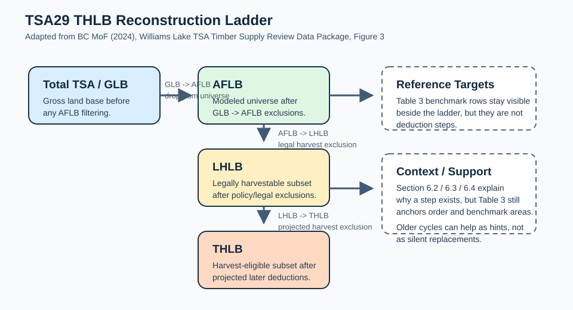

TSR THLB Reconstruction Ladder
==============================

Purpose
-------

Use this guide when you need the **conceptual contract** behind FEMIC's TSA29
THLB reconstruction work, not just the command sequence.

This guide exists because three different things can look similar in chat or in
status reports while still meaning different things:

- the current **hybrid executable bridge**;
- the promoted **fragment-first reconstruction target**; and
- the **TSR-reported benchmark areas** that FEMIC is trying to explain or
  approach.

If those are blurred together, users and helper agents start comparing
incompatible quantities and then report false convergence or false regressions.

Why AFLB and THLB Matter
------------------------

Two upstream contracts matter more than almost anything else in a timber supply
workflow:

- **AFLB defines the modeled universe.**
- **THLB defines the harvest-eligible subset of that universe.**

If AFLB is wrong, FEMIC is solving the wrong problem from the beginning. If
THLB is wrong, the model may still run, but it is allocating harvest over the
wrong eligible land base.

That is why FEMIC must not casually treat AU-only, VDYP-only, or yield-only
filters as though they were automatically valid AFLB or THLB logic.

In particular:

- young or regrowing productive stands are **not** automatically outside the
  AFLB;
- low current volume is **not** automatically an AFLB exclusion;
- AU / VDYP / curve filters are **not** automatically valid THLB filters; and
- productivity or economic exclusions must come from explicit reviewed TSR
  logic with provenance.

The Reconstruction Ladder
-------------------------

FEMIC now treats the TSA29 THLB story as a staged land-base ladder rather than
as a flat list of snippets:

- ``GLB -> AFLB``
- ``AFLB -> LHLB``
- ``LHLB -> THLB``

Those stage labels are now first-class review metadata in the THLB recipe and
status/workbench surfaces.

Interpret them as follows:

- ``GLB -> AFLB`` defines the modeled universe and drops polygons from the
  working land base entirely.
- ``AFLB -> LHLB`` applies legal or policy harvest exclusions to the remaining
  land base.
- ``LHLB -> THLB`` applies projected operational, productivity, or other later
  harvest exclusions to the land base that remains.
- ``Reference targets`` are benchmark or milestone rows, not deductions.
- ``Context / interpretation`` rows are support material, not executable
  exclusions.

For TSA29 specifically, **Table 3 is the canonical backbone** for step order
and benchmark areas. Section ``6.2`` / ``6.3`` / ``6.4`` provide the per-step
supporting rationale and explanatory prose. In other words, Section ``6.2`` /
``6.3`` / ``6.4`` provide the per-step supporting rationale, but they do not
override the Table 3 backbone.

When the current-cycle TSR wording is terse, older TSR cycles can still be
useful hint documents. However, older-cycle TSRs are **hints only**, not silent
replacements for the current-cycle record.

   Adapted from BC MoF (2024), *Williams Lake TSA Timber Supply Review Data
   Package*, Figure 3.

Current FEMIC Execution Modes
-----------------------------

FEMIC currently supports two different THLB stories, and they must not be
confused.

Hybrid executable bridge
~~~~~~~~~~~~~~~~~~~~~~~~

The current reviewed executable path is the **hybrid THLB bridge**:

- it starts from an existing checkpoint that already carries a THLB-like signal;
- it normalizes or preserves that checkpoint THLB signal as the execution
  baseline; and
- it applies reviewed TSR exclusions on top of that baseline.

This path is useful because it is reproducible, reviewable, and already powers
real TSA29 work. But it is **not** the same thing as reconstructing THLB from
raw land-base truth.

Promoted fragment-first target
~~~~~~~~~~~~~~~~~~~~~~~~~~~~~~

The promoted runtime path under ``#128`` / ``#131`` is the
**fragment-first reconstruction** lane:

- start from the raw/resultant land-base geometry;
- for TSA29 today, that means raw ``checkpoint1`` geometry rather than an
  AFLB-style prefiltered subset;
- initialize the AFLB universe explicitly;
- overlay the reviewed exclusion layers in stage order;
- fragment the geometry where needed; and
- assign binary fragment-level THLB membership ``{0,1}``.

That is now the default contract of
``femic tsr thlb-netdown-run --execution-mode reconstructed``.

Important boundary:

- the hybrid bridge still exists as a separate executable lane;
- reconstructed mode is fragment-first by default;
- reconstructed exact spatial work is now LU-wise by default, so FEMIC cuts one
  Landscape Unit chunk at a time instead of trying to cut the whole TSA in one
  giant exact-overlay job;
- reconstructed mode now supports exact spatial overlay plus explicit
  recipe-driven aspatial fallback where the reviewed recipe already carries a
  TSR target-area deduction;
- when the reconstructed run reaches the AFLB milestone boundary, FEMIC now
  emits ``data/tsr/aflb_checkpoint.feather`` as the canonical downstream
  restart artifact and ``data/tsr/aflb_checkpoint.gpkg`` by default as the
  GIS-facing companion;
- later-stage experimentation should prefer restarting from
  ``--checkpoint-path data/tsr/aflb_checkpoint.feather`` instead of rebuilding
  GLB -> AFLB every time;
- blocked exact-overlay seams still remain explicit instead of being silently
  converted into fallback; and
- the old coarse stand-binary approximation survives only as an explicit
  non-default debug fallback, not as silent normal behavior.

Fallback and Review Paths
-------------------------

FEMIC v1 needs two honest user paths.

Preferred path
~~~~~~~~~~~~~~

The preferred path is:

- reviewed recipe scaffolds;
- LLM/coding-agent assistance to accelerate review and iteration; and
- explicit overlays / overrides when public inputs do not finish the job.

This path is usually the fastest way to converge on a benchmarked TSA29 read,
but it still depends on reviewed artifacts and provenance-preserving edits.

Fallback no-LLM path
~~~~~~~~~~~~~~~~~~~~

The fallback path is:

- reviewed recipe scaffolds;
- a human analyst with no LLM available; and
- generated review/workbench surfaces that behave as a warm-start checklist
  rather than dumping the user into raw JSON.

That means the no-LLM path is not an afterthought. It is part of the FEMIC v1
contract.

Blocked or approximate seams must also stay explicit:

- **blocked/manual** means FEMIC does not yet have a trustworthy executable
  path for that clause;
- **override/overlay** means the user intentionally substituted a reviewed
  source or interpretation seam and kept provenance;
- **aspatial fallback** means FEMIC is using a documented area-reduction bridge
  rather than exact spatial truth; and
- none of those should be presented as though they were the same as exact
  fragment-level overlay.

Comparison Contract
-------------------

When users say "how close are we?", the first question should be:

**Close to which reference surface?**

For TSA29 there are three different comparison surfaces:

1. **Reconstructed THLB**
   The fragment/resultant target path that starts from raw land-base geometry
   and assigns binary THLB membership.
2. **Legacy raster-derived THLB**
   The historical checkpoint/raster signal that still seeds the hybrid bridge.
3. **TSR-reported THLB**
   The benchmark areas reported in the Williams Lake TSR package.

Those comparisons are useful only when the runner, checkpoint, scope, and
stop-line are compatible.

Good comparison examples:

- hybrid-vs-TSR for the same accepted parent-step stop-line;
- reconstructed-vs-TSR for the same stage/step ledger; and
- reconstructed-vs-legacy-raster to understand how much of the difference is
  coming from the old baseline rather than from later exclusions.

The plain-language comparison surface for this is now:

- ``python -m femic tsr thlb-reconstruction-compare --instance-root ...``

That command reads the existing reviewed and reconstructed TSA29 artifacts and
emits a parent-step report that shows:

- strict reconstructed THLB vs TSR-reported THLB as the governing benchmark;
- reviewed bridge THLB vs TSR-reported THLB as context for why the reviewed
  lane was accepted;
- strict reconstructed vs reviewed bridge deltas as explanatory context rather
  than the main score; and
- which parent steps currently look:
  - close enough to TSR;
  - materially high or low against TSR;
  - blocked or missing-data driven;
  - or like accepted reviewed bridge / fallback territory.

Important practical interpretation:

- the reviewed lane was accepted because its cumulative THLB is close enough
  to the TSR benchmark for exploratory case-study use;
- that does **not** make reviewed per-step behavior the automatic gold
  standard for strict reconstruction; and
- a strict parent step becomes a top-priority repair when it is materially bad
  against TSR, not merely because it differs from the reviewed lane.

Bad comparison examples:

- comparing a generic flattened full-recipe run against a reviewed parent-step
  cumulative benchmark as though they were the same metric;
- comparing a smoke-subset run to a full-TSA cumulative target without saying
  it is a smoke-only proving ground; and
- comparing a step-20 cumulative read to a step-23 TSR target without carrying
  the downstream steps honestly.

Cumulative comparisons are therefore meaningful only when:

- the same runner family is used;
- the same baseline/checkpoint family is used;
- the same geographic scope is used; and
- the same stop-line or final step is being compared.

THLB Accounting Directives
--------------------------

FEMIC stepwise accounting now has one shared rule across strict, reviewed, and
comparison surfaces:

- the canonical marginal metric is ``net_removed_area_ha``; and
- it must equal the true before/after change in currently active managed area
  caused by that step at the moment it runs.

That means FEMIC must not present any of the following as though they were the
main stepwise deduction:

- gross candidate area;
- gross matched overlay area;
- gross area touched by an aspatial fallback or scaling operation; or
- residual benchmark target area.

Those values can still be useful diagnostics, but they are secondary.

Important consequences:

- milestone or reference rows do **not** have a marginal deduction;
- milestone rows report only remaining/cumulative state and benchmark deltas;
- exact overlay steps report net active-area change after applying to the
  current state; and
- aspatial fallback steps report the net change that actually landed on the
  current active state, not just the requested target.

Accepted skips or no-op tail steps also need plain interpretation:

- they mean FEMIC reviewed the clause and chose to record an explicit
  ``no_deduction`` or skipped state for the accepted lane;
- they do **not** mean the clause vanished from the TSR;
- and they should stay visible in status/workbench surfaces so later reviewers
  can see what was accepted, skipped, blocked, or still unresolved.

Worked TSA29 Read
-----------------

The current accepted TSA29 closeout gives a compact example of the comparison
contract.

- The accepted lane stops treating step ``023`` as a positive deduction because
  the same-instrument parent-step reruns showed the post-step-``021`` result
  was already below the final TSR cumulative target.
- That means an additional positive step-``023`` deduction would move FEMIC
  farther away from the TSR cumulative target, not closer.
- So the accepted closeout records step ``021`` as the last active tail
  deduction and step ``023`` as an explicit reviewed ``0 ha`` no-op tail step.

The important lesson is not the exact hectare number. The important lesson is
the method:

- compare like with like;
- keep the runner and stop-line explicit;
- distinguish reviewed no-op logic from blocked logic; and
- keep the benchmark explanation auditable in the recipe/status/workbench
  surfaces.

How This Guide Fits the Other Docs
----------------------------------

Use the other docs for different jobs:

- :doc:`tsr-intelligence-workflow` for the operational review/build/run flow;
- :doc:`interpret-rebuild-reports` for reading FEMIC rebuild evidence more
  generally;
- :doc:`../reference/cli` for command syntax and option surfaces; and
- :doc:`../reference/contracts/stage-boundaries-and-canonical-artifacts` for
  adjacent stage-boundary contracts.

Use **this** guide when you need the conceptual ladder, the benchmark
comparison contract, and the hybrid-vs-reconstructed distinction stated
plainly in one place.
